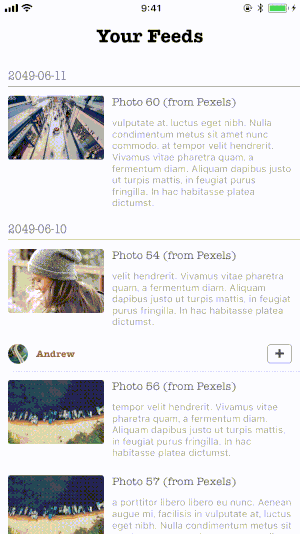
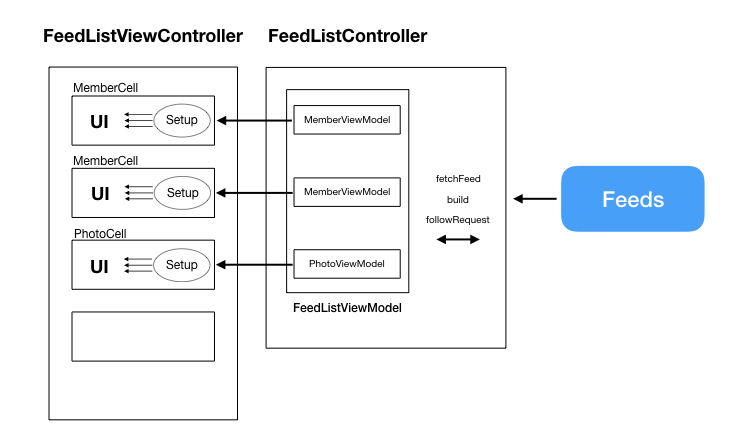

# TheGreatWall - A sample project for tackling complicated table view using MVVM pattern

This is a simple newsfeed app. In this app, you can check your friends photos, and the system suggests you more people to follow. 

The architecture is quite simple, too:

I'll share how to use MVVM with protoocl techniques to simplify the table view and make the resposibility unique and clear in my article (TBD).